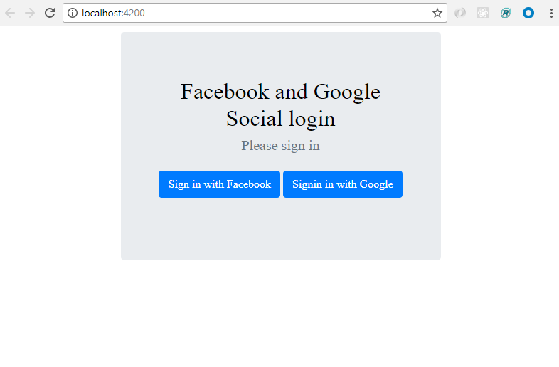

# Angular5 Social Login Facebook and Google 
It is a Angular 5 social login project after login user date is populating, here I have used the angular5-social-login plug-in to fetch user data.

    

To preview demo of Angular5 Social Login project, [click here](https://stackblitz.com/edit/angular5-social-login?embed=1&file=index.html&hideExplorer=1&hideNavigation=1&view=preview)

## Getting Started
Download  or Clone the repository in your machine and run following command.

### Installing
    - npm install

### Run server
    - ng serve
